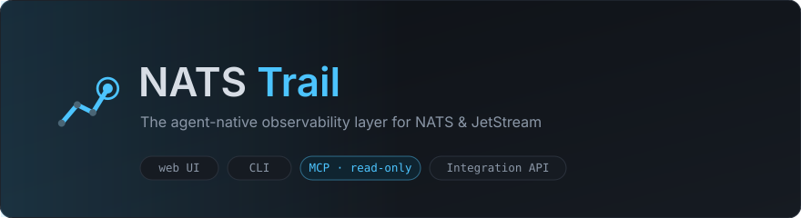
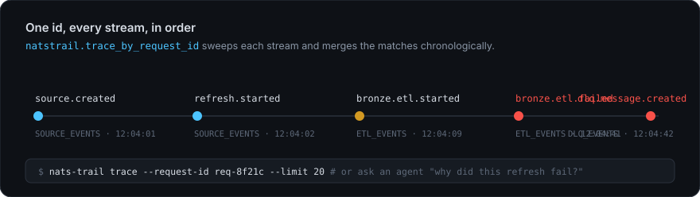
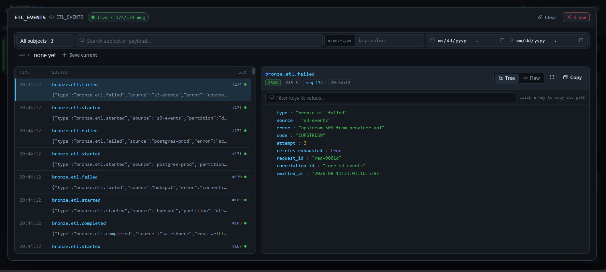
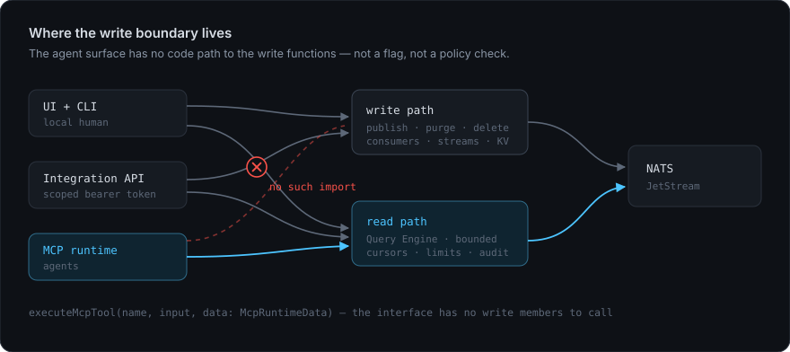
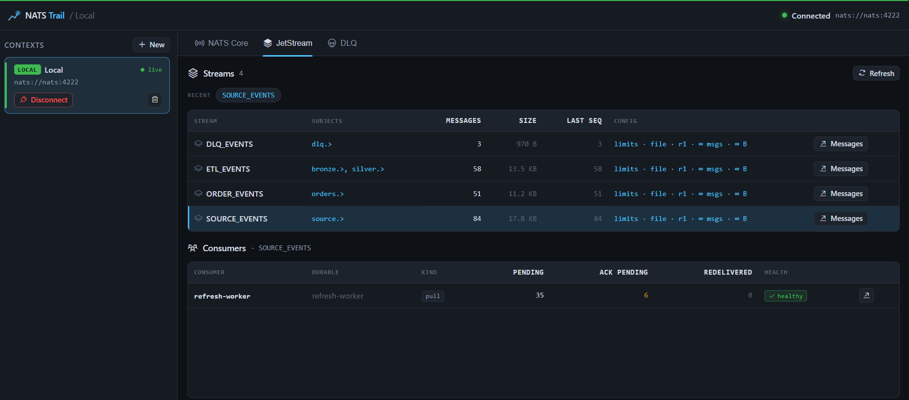
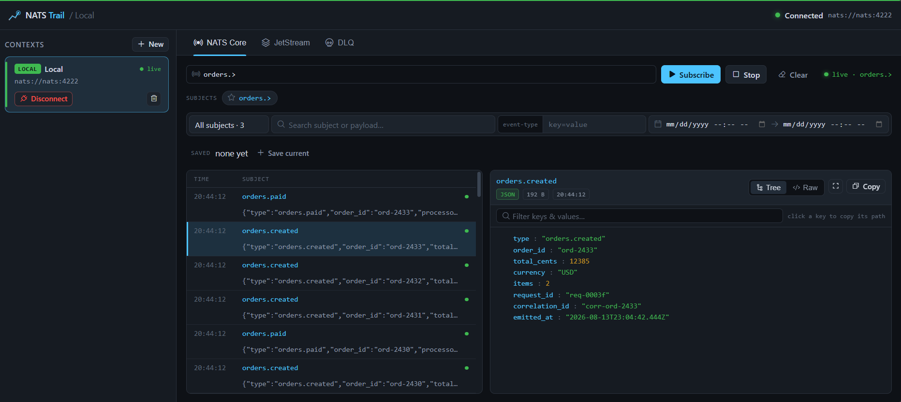
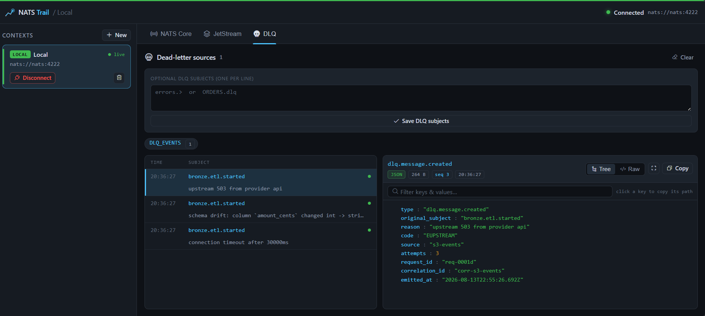

<p align="center">
  
</p>

<p align="center">
  <a href="https://www.npmjs.com/package/nats-trail"></a>
  <a href="LICENSE"></a>
  <a href="https://www.npmjs.com/package/nats-trail"></a>
  
  
</p>

<p align="center">
  <b>Give an AI agent safe access to your production event bus.</b><br>
  <sub>A web UI, a CLI and an MCP server over one bounded query engine — so humans and agents debug NATS from the same source of truth.</sub>
</p>

---

## Why this exists

Every NATS GUI answers *"what is in this stream?"*. That is the easy question.

The hard question in an event-driven system is **"why did this one flow fail?"** — and answering it
means following a single `request_id` across four streams, three services and a dead-letter subject.
Today you do that by hand, with a terminal per stream.

NATS Trail answers that question directly, and exposes the answer to **agents** as a typed, bounded,
read-only tool contract — so you can point Claude at production and ask.

<p align="center">
  
</p>

```bash
nats-trail trace --request-id req-0001d --limit 20
```

Or, from an agent: *"Why did the refresh for s3-events fail?"* — and it lands on the message that
actually broke, with the retry state and the correlation ids already extracted:

<p align="center">
  
</p>

---

## The part nobody else does

There are several NATS MCP servers. They shell out to the `nats` CLI, return raw dumps, and expose
`publish` and `delete` while describing themselves as read-only.

NATS Trail treats the agent surface as a **contract**, not a wrapper:

| | NATS Trail | Typical NATS MCP server |
|---|---|---|
| Tool schemas | Explicit JSON input **and** output schemas per tool | None, or input only |
| Result size | `limit` is **required**, capped at 200, with cursors | Unbounded |
| Long scans | `maxScan` budget with explicit truncation warnings | Scans until it dies |
| Message shape | subject, timestamp, stream/seq, truncation flag, extracted `request_id` / `correlation_id` | Raw payload dump |
| Errors | Structured envelope with `code` and `retriable` | Stack traces or plain strings |
| Writes | **Unreachable from the agent runtime** | `publish`, KV and object writes exposed |
| Audit | Every call logged with origin and token identity; mutations with their arguments | None |

### "Read-only" here means unreachable, not disabled

<p align="center">
  
</p>

NATS Trail *can* write: publish, purge, delete messages, consumers and streams. Those live behind
`/api/mutate`, reachable from the UI and the CLI.

`executeMcpTool()` receives an `McpRuntimeData` interface that exposes only read functions. There is
no disabled `publish` behind a feature flag — **there is no `publish` to call.** A misconfigured
environment variable cannot purge your production stream, because the code path does not exist. CLI
write commands additionally refuse to run under `--agent`, and the test suite reads the source to
assert none of this has been quietly undone.

This is the only reason it is reasonable to hand an agent a `prod` context.

---

## Install

```bash
npx nats-trail serve
```

Open **http://127.0.0.1:4000** — one process serves the UI and the API.

Prefer containers? The compose file brings up NATS Trail next to a JetStream-enabled server:

```bash
docker compose up
```

<details>
<summary>From source</summary>

```bash
git clone https://github.com/solsolettidev/nats-trail
cd nats-trail
npm install
npm start
```

</details>

<details>
<summary>Development with hot reload</summary>

```bash
npm run dev
```

- UI: http://localhost:5173 (proxies `/api` and `/ws` to the bridge)
- API bridge: http://localhost:4000

`npm run dev` runs the TypeScript watcher, the API bridge and the UI together.

</details>

**Requirements:** Node.js >= 22 (for the built-in SQLite used by the correlation index) and a reachable NATS server (`nats-server -js` is fine).

---

## Use it as an MCP server

Point any MCP client at the stdio server. For Claude Code:

```bash
claude mcp add nats-trail -- npx -y @nats-trail/mcp
```

Or wire it manually:

```json
{
  "mcpServers": {
    "nats-trail": {
      "command": "natstrail-mcp",
      "env": {
        "NATS_TRAIL_API": "http://127.0.0.1:4000",
        "NATS_TRAIL_TOKEN": "<bearer token>"
      }
    }
  }
}
```

Twenty-five read-only tools, all returning the same envelope:

```
# start here when the topology is unknown
natstrail.discover_subjects        subjects that carry traffic + inferred payload shapes
natstrail.get_health_summary       what is broken right now, ranked
natstrail.reconstruct_flow         the causal chain for one request_id
natstrail.enrich_incident          flat context for an incident: flow + dead letters + health

# messages
natstrail.search_messages          natstrail.get_message_detail
natstrail.trace_by_request_id      natstrail.trace_by_correlation_id
natstrail.search_dlq               natstrail.run_filter

# topology
natstrail.list_streams             natstrail.get_stream_info
natstrail.list_consumers           natstrail.list_kv_buckets
natstrail.list_kv_keys             natstrail.get_kv_history
natstrail.list_object_buckets      natstrail.list_objects

# operations
natstrail.get_server_health        natstrail.list_server_connections
natstrail.list_contexts            natstrail.get_connection_status
natstrail.list_filters             natstrail.list_audit
natstrail.enrich_sentry
```

See [`docs/mcp-agent.md`](docs/mcp-agent.md).

---

## Three surfaces, one engine

```
                 ┌──  Web UI          explore visually, save filters
Query Engine  ───┼──  CLI             scripts, pipelines, humans in a terminal
  (core)         └──  MCP + HTTP API  agents, Sentry, dashboards
```

A filter you save in the UI is the same filter `nats-trail filter run` executes, and the same one
`natstrail.run_filter` hands an agent. Configure a context once; use it everywhere.

- **`packages/ui`** — React + Vite. Presentation only.
- **`packages/server`** — Express + WebSocket bridge. Owns connections and credentials.
- **`packages/core`** — the Query Engine: envelopes, limits, truncation, filters, error normalization.
- **`packages/cli`** — the `nats-trail` binary: query commands, `serve`, and an interactive shell.
- **`packages/mcp`** — tool contracts and the stdio server.

See [`docs/architecture.md`](docs/architecture.md).

---

## Features

**Inspect** — context selector (local / dev / staging / prod) with a prod confirmation gate, live
subject subscription, JSON pretty print with tree view and in-payload search, stream and consumer
browsing, auto-detected DLQ panel.

<table>
<tr>
<td width="50%"><br><sub><b>JetStream</b> — streams, subjects, counts and consumer health.</sub></td>
<td width="50%"> and a selected message rendered as a JSON tree"><br><sub><b>NATS Core</b> — live subject subscription with filters.</sub></td>
</tr>
<tr>
<td width="50%"><br><sub><b>DLQ</b> — auto-detected dead letters with reason and origin.</sub></td>
<td width="50%"><br><sub><b>Viewer</b> — tree, raw, search, fullscreen, copy-path.</sub></td>
</tr>
</table>

**Understand** — subject discovery infers payload shapes from real traffic, flow reconstruction
turns one `request_id` into a causal chain, and the health summary ranks what is actually broken.

**Query** — bounded stream scans with cursors and time windows, filters by subject, date, text and
JSON event type, saved filters shared across all three surfaces. Binary payloads (protobuf, msgpack)
are detected and shown as hex dumps rather than mojibake.

**Browse** — KV buckets with per-key revision history including deletes, Object Store metadata, and
server health from the monitoring port (`varz` / `jsz` / `connz`).

**Change** — publish, request/reply, purge, and delete messages, consumers and streams, from the UI
and the CLI, behind confirmation. Never from the agent surface.

**Integrate** — read-only HTTP API under `/api/integration`, bearer tokens with per-token audit
identity, and `POST /api/integration/enrich/sentry` to attach NATS context to an error without
exposing credentials.

Full list in [`docs/features.md`](docs/features.md) · CLI reference in [`docs/cli.md`](docs/cli.md).

---

## Security

Credentials live in contexts stored locally under `data/` (git-ignored). The UI never holds the NATS
connection — it always goes through the bridge, which pools one connection per context.

The server binds to `127.0.0.1` by default because `/api/contexts` and `/api/connect` are
unauthenticated local endpoints. To expose the Integration API and the WebSocket, configure bearer
tokens with `NATS_TRAIL_TOKENS=name:token` or `data/tokens.json`; audit entries then record the
authenticated token name per call.

---

## Roadmap

Tracked in [`docs/roadmap.md`](docs/roadmap.md).

**Phases 0–2 are complete.** npm release · KV and Object Store browsing · server health · binary
payload handling · nkey auth · subject discovery · flow reconstruction · health summary · incident
enrichment for Sentry, Grafana and Datadog · stream, consumer and KV administration — all writes
human-only, behind scoped tokens and audited with their arguments.

**Next** — multi-user access and cluster awareness, both open design questions rather than pending work.

**Deliberately out** — protobuf and msgpack *field* decoding (needs a per-subject schema registry)
and competing with [NUI](https://github.com/nats-nui/nui) on GUI breadth. See
[`docs/roadmap.md`](docs/roadmap.md).

**Soon** — for teams that explicitly want agent writes, a **separate opt-in binary**
(`natstrail-mcp-write`) that has to be installed on purpose. Never a flag on the read-only server:
the guarantee above is only worth something if it cannot be switched off by accident.

---

## Contributing

Issues and PRs welcome. See [`docs/development.md`](docs/development.md) for the build layout.

## License

[Apache-2.0](LICENSE) © Sol Soletti
